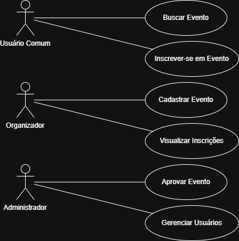
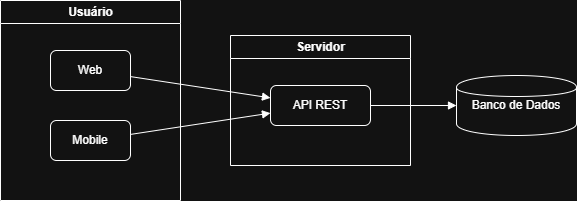
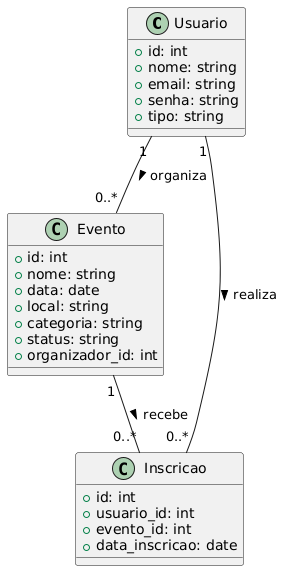
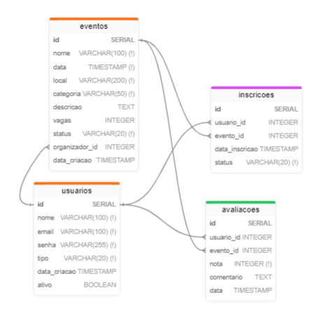

# EcoAgenda

## Documentação de Projeto

**Versão 1.0**      

Projeto de sistema elaborado pelo(s) aluno(s):

 Davi Augusto Dias Soares                 
 Pedro Henrique Morais Marques           

Data de criação: 29/05/2025

## Tabela de Conteúdo

1. [Introdução](#1-introdução)         
2. [Modelos de Usuário e Requisitos](#2-modelos-de-usuário-e-requisitos)             
   2.1 [Descrição de Atores](#21-descrição-de-atores)          
   2.2 [Modelo de Casos de Uso e Histórias de Usuários](#22-modelo-de-casos-de-uso-e-histórias-de-usuários)               
   2.3 [Diagrama de Sequência do Sistema e Contrato de Operações](#23-diagrama-de-sequência-do-sistema-e-contrato-de-operações)            
3. [Modelos de Projeto](#3-modelos-de-projeto)           
   3.1 [Arquitetura](#31-arquitetura)           
   3.2 [Diagrama de Componentes e Implantação](#32-diagrama-de-componentes-e-implantação)          
   3.3 [Diagrama de Classes](#33-diagrama-de-classes)           
   3.4 [Diagramas de Sequência](#34-diagramas-de-sequência)          
   3.5 [Diagramas de Comunicação](#35-diagramas-de-comunicação)           
   3.6 [Diagramas de Estados](#36-diagramas-de-estados)           
4. [Modelos de Dados](#4-modelos-de-dados)                 

## Histórico de Revisões

| Nome | Data | Razões para Mudança | Versão |
|---|---|---|---|
| Davi Augusto | 29/05/25 | Criação do documento | 1.0 |
| Pedro Henrique | 29/05/25 | Revisão do documento | 1.0 |
| Pedro Henrique | 29/05/25 | Transcrição docx | 1.0 |

## 1. Introdução

O EcoAgenda é um sistema web e mobile para gerenciamento de eventos sustentáveis, permitindo que usuários organizem, divulguem e participem de eventos com foco em sustentabilidade, como feiras ecológicas, mutirões de limpeza, palestras e workshops ambientais.

Este documento agrega: 
1. A elaboração e revisão de modelos de domínio;
2. Modelos de projeto para o sistema EcoAgenda. A referência principal para a descrição geral do problema, domínio e requisitos do sistema é o documento de especificação que descreve a visão de domínio do sistema.

## 2. Modelos de Usuário e Requisitos              

### 2.1 Descrição de Atores

**Usuário Comum**: Pessoa que acessa o sistema para buscar, se inscrever e participar de eventos sustentáveis.

**Organizador**: Responsável por cadastrar e gerenciar eventos, visualizar inscrições e interagir com participantes.

**Administrador**: Gerencia usuários, aprova eventos e monitora o funcionamento do sistema.

### 2.2 Modelo de Casos de Uso e Histórias de Usuários  

#### Casos de Uso

- UC-01: Cadastrar Evento
- UC-02: Buscar Evento
- UC-03: Inscrever-se em Evento
- UC-04: Aprovar Evento
- UC-05: Gerenciar Usuários

#### Histórias de Usuário

- Como usuário, quero buscar eventos por categoria para encontrar atividades do meu interesse.
- Como organizador, quero cadastrar eventos para divulgar ações sustentáveis.
- Como administrador, quero aprovar eventos para garantir a qualidade das informações.

#### Diagrama de Casos de Uso

### 2.3 Diagrama de Sequência do Sistema e Contrato de Operações

#### Contrato de Operação

- **Operação**: Inscrever-se em Evento         
- **Referências cruzadas**: UC-03
- **Pré-condições**: Usuário autenticado, evento disponível
- **Pós-condições**: Inscrição registrada, vaga reduzida

## 3. Modelos de Projeto

### 3.1 Arquitetura

O sistema utiliza arquitetura em três camadas: apresentação (web/mobile), lógica de negócios (API REST), e persistência (banco de dados relacional).

#### Diagrama de Arquitetura

<!-- Não há PNG específico, manter vazio ou adicionar se houver -->

### 3.2 Diagrama de Componentes e Implantação

#### Diagrama de Componentes

<!-- Não há PNG específico, manter vazio ou adicionar se houver -->

#### Diagrama de Implantação

<!-- Não há PNG específico, manter vazio ou adicionar se houver -->

### 3.3 Diagrama de Classes

#### Diagrama de Classes

### 3.4 Diagramas de Sequência

#### Cadastro de Evento

<!-- Não há PNG específico, manter vazio ou adicionar se houver -->

#### Aprovação de Evento

<!-- Não há PNG específico, manter vazio ou adicionar se houver -->

### 3.5 Diagramas de Comunicação

#### Comunicação entre usuário e sistema para busca e inscrição

<!-- Não há PNG específico, manter vazio ou adicionar se houver -->

### 3.6 Diagramas de Estados

#### Estado do Evento:

<!-- Não há PNG específico, manter vazio ou adicionar se houver -->

### 4. Modelos de Dados

#### Esquema de Banco de Dados:

**Tabela Usuario**: id, nome, email, senha, tipo          
**Tabela Evento**: id, nome, data, local, categoria, status, organizador_id             
**Tabela Inscricao**: id, usuario_id, evento_id, data_inscricao     
           

#### Estratégias de Mapeamento:

O sistema utiliza o padrão ORM (Object-Relational Mapping) para mapear as classes do domínio para as tabelas do banco de dados relacional. Especificamente:

##### Mapeamento de Classes para Tabelas:

- Cada classe de domínio (Usuario, Evento, Inscricao, Avaliacao) é mapeada para uma tabela correspondente.
- Atributos das classes são mapeados para colunas nas tabelas.

##### Mapeamento de Relacionamentos:

- Relacionamentos 1:N são implementados através de chaves estrangeiras.
- Relacionamentos N:N são implementados através de tabelas de junção (como a tabela inscricoes).

##### Estratégia de Herança:

- O sistema utiliza a estratégia de discriminador único (single table inheritance) para o tipo de usuário, usando o campo "tipo" para diferenciar entre usuário comum, organizador e administrador.
Lazy Loading vs. 

##### Eager Loading:

- Relacionamentos são carregados sob demanda (lazy loading) para melhorar a performance.
- Em operações críticas, como listagem de eventos com suas avaliações, é utilizado carregamento antecipado (eager loading).

##### Caching:

- Implementação de cache em dois níveis: cache de primeiro nível (sessão) e cache de segundo nível (aplicação).
- E ventos populares e dados frequentemente acessados são mantidos em cache para reduzir consultas ao banco de dados.